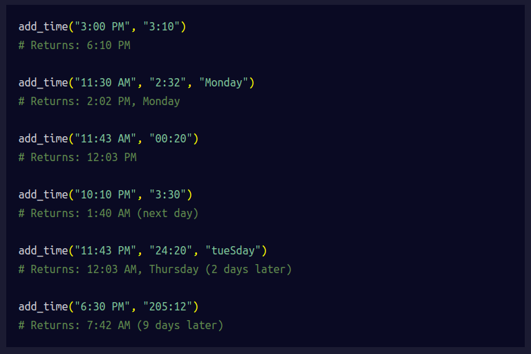
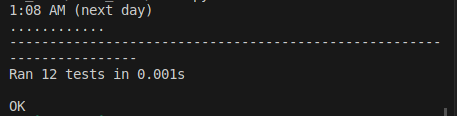

# **Time Calculator**
Write a function named add_time that takes in two required parameters and one optional parameter:

+ a start time in the 12-hour clock format (ending in AM or PM) 
+ a duration time that indicates the number of hours and minutes 
+ (optional) a starting day of the week, case insensitive 
  
The function should add the duration time to the start time and return the result.

If the result will be the next day, it should show (next day) after the time. If the result will be more than 

one day later, it should show (n days later) after the time, where "n" is the number of days later.

If the function is given the optional starting day of the week parameter, then the output should display the day

of the week of the result. The day of the week in the output should appear after the time and before the number of days later.

Below are some examples of different cases the function should handle. Pay close attention to the spacing and 

punctuation of the results.

  

Do not import any Python libraries. Assume that the start times are valid times. The minutes in the duration 

time will be a whole number less than 60, but the hour can be any whole number.

## Development
Write your code in time_calculator.py. For development, you can use main.py to test your time_calculator() 

function. Click the "run" button and main.py will run.

## Testing

The unit tests for this project are in test_module.py. We imported the tests from test_module.py to main.py for 

your convenience. The tests will run automatically whenever you hit the "run" button.

## Resource  
`This resource will help you calculate the time`
<https://www.freecodecamp.org/news/mathematics-converting-am-pm-to-24-hour-clock/#:~:text=Converting%20from%20a%2024%20Hour,%3A55%20%3D%2012%3A55%20AM> 

## Note from Me

This project is very tricky, and it takes time to analyze it well.
I thought it was easy, but it took me days to figure out the issue with my code.
I was able to write the code without any problems, except for the logic to handle next day.
Out of 12 test, 11 passed and 1 was an issue. It took me two days to figure it out.

## Test Passed

All the test passed.

  